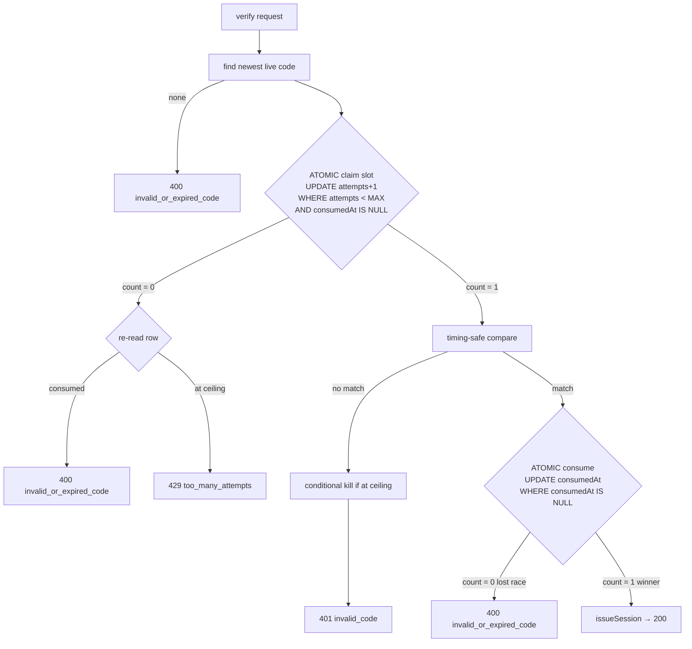
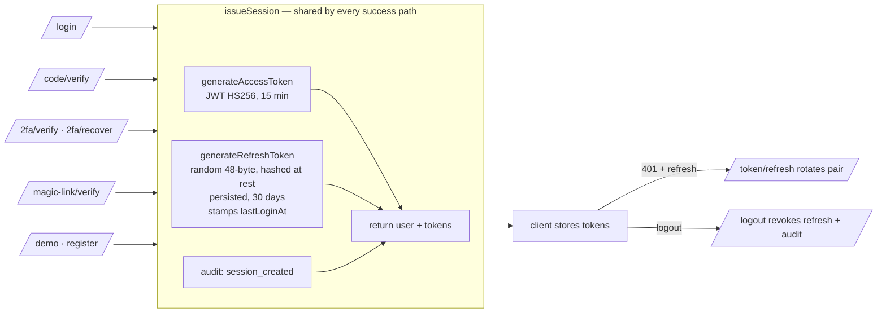

# Authentication

Wasil's primary front door for parents is **passwordless**: enter your email,
receive a short-lived 6-digit code, type it in. Staff/admins may also use
email+password, and either factor can be gated by TOTP 2FA. This document covers
how the passwordless system works, the security guarantees it makes, and how it
behaves under concurrency and at scale.

> Scope note: this reflects **Production Hardening Sprint 1**, which strengthened
> the existing passwordless design (atomic attempt-lock, distributed rate
> limiting, shared session issuance, audit trail, lifecycle cleanup) without
> changing the user experience.

---

## 1. Flow

```mermaid
sequenceDiagram
    autonumber
    participant P as Parent (browser)
    participant API as Auth API (any instance)
    participant DB as Postgres
    participant M as Email (Resend)

    P->>API: POST /auth/code/request { email }
    API->>DB: rate-limit check (per-email, per-IP) — shared counters
    API->>DB: find user by email
    alt user exists
        API->>DB: supersede prior codes; INSERT LoginCode(hash, expiresAt, attempts=0)
        API-->>M: send 6-digit code (fire-and-forget)
    else no account
        Note over API: do nothing (no code, no email)
    end
    API-->>P: 200 { ok: true }   %% identical response either way (enumeration-safe)

    P->>API: POST /auth/code/verify { email, code }
    API->>DB: rate-limit check (per-email, per-IP)
    API->>DB: find newest live code
    API->>DB: ATOMIC claim a slot (attempts++ while < MAX and unconsumed)
    alt slot claimed and code matches
        API->>DB: ATOMIC consume (set consumedAt while null) — single winner
        API->>DB: issue access + refresh (issueSession)
        API-->>P: 200 { user, accessToken, refreshToken }
    else wrong / locked / expired
        API-->>P: 401 invalid_code / 429 too_many_attempts / 400 invalid_or_expired_code
    end
```

The code **is** the secret — there is no link and no token in the email, so the
flow works identically on iOS, Android, PWA and desktop with no deep-link
plumbing. A 2FA-enabled account gets the existing `{ twoFactorRequired,
twoFactorSessionToken }` handoff after the code is verified.

---

## 2. Security guarantees

| Guarantee | How it is enforced |
| --- | --- |
| **Codes are never stored in plaintext** | Only `sha256(code)` is persisted (`LoginCode.codeHash`); the plaintext is emailed once and never written. |
| **Single use** | On a correct code, `consumedAt` is set with a conditional `UPDATE … WHERE consumedAt IS NULL`; exactly one concurrent submission wins → exactly one session. |
| **At most 5 attempts per code** | Each verify **atomically claims a slot** (`UPDATE … SET attempts = attempts+1 WHERE attempts < 5 AND consumedAt IS NULL`). Because a single UPDATE is row-locked, at most 5 claims can ever succeed — the cap **cannot** be bypassed by flooding parallel guesses. Proven at 10,000 concurrent (see §8). |
| **Only the newest code is valid** | Each request deletes prior codes for the email; verify reads the newest un-consumed, un-expired row. |
| **Short-lived** | Codes expire 10 minutes after issue (`expiresAt`); expired codes never verify. |
| **Enumeration-safe** | `/code/request` always returns `200 { ok: true }`. The email send is fire-and-forget, so an existing account and an unknown one return in the same time (closing the timing side-channel). `/code/verify` reveals nothing: an unknown email simply has no live code. |
| **Timing-safe comparison** | Hashes are compared with `crypto.timingSafeEqual` on equal-length buffers. |
| **No CSRF exposure** | The API is Bearer-token via the `Authorization` header with no ambient cookie credentials, so these endpoints are not CSRF-reachable. |
| **No open redirect** | The code flow performs no redirect. |

### The concurrency model (the crux)



Two single-statement, row-locked `UPDATE`s are the whole trick: the **claim**
caps how many requests may ever compare a code, and the **consume** guarantees a
single success. No `SELECT … FOR UPDATE` and no long-held transaction are needed.

---

## 3. Rate limiting

Four limiters guard the passwordless endpoints, all backed by a **Postgres store**
(`services/rateLimitStore.ts`) so counters are shared across every app instance:

| Limiter | Window | Max | Key |
| --- | --- | --- | --- |
| `code_req_email` | 10 min | 3 | email |
| `code_req_ip` | 10 min | 20 | IP |
| `code_vrf_email` | 10 min | 10 | email |
| `code_vrf_ip` | 10 min | 50 | IP |

**Why not the in-memory default:** `express-rate-limit`'s MemoryStore lives in
one process's heap. With N instances behind a load balancer each counts
independently, so the effective limit becomes N× the configured value and a
rolling deploy resets every counter — a real bypass for a brute-force control.
The store keeps counters in the database every instance already shares, via a
single row-locked `INSERT … ON CONFLICT DO UPDATE` fixed-window upsert.

**Why Postgres and not Redis:** the app runs no Redis today; adding one is
infrastructure to provision, secure and operate. Auth request volume is modest
and one extra indexed upsert per auth request is negligible. If auth RPS ever
grows enough to matter, `rate-limit-redis` is a drop-in behind the same `Store`
contract (see §9).

These limiters are **defence-in-depth on top of** the per-code 5-attempt lock —
the lock is the hard guarantee; the limiters throttle abuse and email bombing.

---

## 4. Lockout behaviour

- A code locks permanently once its `attempts` reaches **5** (`consumedAt` is set
  at the ceiling so no later correct guess can revive it).
- Lockout is **per code**, not per account — a parent simply requests a new code
  (subject to the per-email request limiter) and continues. There is no account
  freeze, so passwordless brute-force cannot be used to lock a victim out.
- The separate password path retains its own `lockedUntil` account lockout,
  unchanged.

---

## 5. Session lifecycle



- **Access token**: JWT (HS256), 15-minute expiry, carries `userId/role/schoolId`.
- **Refresh token**: a random 48-byte secret, stored **hashed** (SHA-256) so a
  read-only DB leak yields nothing usable; 30-day expiry; rotated on use with an
  atomic claim-and-delete that tolerates concurrent refreshes (two tabs).
- **Single issuance point**: every successful authentication path — password,
  code, 2FA, 2FA-recovery, magic-link, demo, register — now goes through
  `issueSession()` (`services/session.ts`), so token lifetime, `lastLoginAt`
  stamping and the `session_created` audit event live in exactly one place.
- **Logout** revokes the presented refresh token and records a `logout` event.

> Known follow-up (unchanged this sprint): refresh tokens are stored in the
> client's `localStorage`, which an XSS could read. Moving them to an
> `httpOnly; Secure; SameSite` cookie is tracked separately — it is cross-app and
> out of scope for the passwordless hardening.

---

## 6. Audit logging

A dedicated `AuthEvent` table (`services/authAudit.ts`) records the auth
lifecycle for security investigations. It is **separate** from the business
`AuditLog`, which requires an authenticated user, a non-null `schoolId` and an
enum action — and therefore cannot represent pre-auth events like a failed
verification or a request for an unknown email.

Events: `login_requested`, `code_issued`, `code_resent`, `code_request_unknown`,
`verify_attempted`, `verify_succeeded`, `verify_failed` (with a `reason`),
`lockout_triggered`, `lockout_active`, `session_created`,
`two_factor_required`, `logout`.

Design rules:
- **Never logs a code, code hash, token or password.** A key-denylist scrubs
  metadata as belt-and-braces; the subject email (the investigator's search key)
  is stored, the secret never is.
- **No foreign keys** — writes never block the hot auth path and rows outlive a
  deleted user.
- **Best-effort** — a failed audit write is logged to stderr and never breaks or
  slows sign-in.

Indexed by `email`, `userId`, `event` and `createdAt`, so an investigator can
pull "everything that happened for this email / this account / this event type in
this window" cheaply.

---

## 7. Cleanup (lifecycle management)

The scheduled `cleanupExpiredTokens()` job (`services/cleanup.ts`) sweeps:

| Table | Deleted when | Never deletes |
| --- | --- | --- |
| `LoginCode` | `expiresAt < now` **OR** `consumedAt IS NOT NULL` | an **active** code (un-consumed AND within TTL) — a parent mid-sign-in is safe |
| `RateLimit` | `expiresAt < now` (closed window) | an open window |
| `AuthEvent` | `createdAt` older than 180 days | anything inside the retention window |
| `RefreshToken` | `expiresAt < now` | live tokens |
| `MagicLinkToken` | expired or >24h old | live tokens |

The `LoginCode` delete predicate can never match an active code, so cleanup and
sign-in cannot race destructively.

---

## 8. Performance & scaling (measured)

Benchmark of the verify DB path (`scripts/authBench.ts`) against Postgres 16,
`connection_limit=20`, at 100 / 1,000 / 10,000 simultaneous attempts. Two shapes:
**throughput** (each attempt hits a different code row) and **contention** (all
attempts hit one row — maximum lock contention, the security-critical path).

| Concurrency | Shape | Throughput | p50 | p95 | p99 | Single-row result |
| ---: | --- | ---: | ---: | ---: | ---: | --- |
| 100 | throughput | ~1,195/s | 76 ms | 82 ms | 82 ms | — |
| 100 | contention | ~2,006/s | 43 ms | 49 ms | 49 ms | **attempts = 5, consumed** |
| 1,000 | throughput | ~1,475/s | 589 ms | 655 ms | 662 ms | — |
| 1,000 | contention | ~2,739/s | 278 ms | 344 ms | 350 ms | **attempts = 5, consumed** |
| 10,000 | throughput | ~836/s | 10.4 s | 11.6 s | 11.8 s | — |
| 10,000 | contention | ~1,301/s | 5.8 s | 7.4 s | 7.5 s | **attempts = 5, consumed** |

**Correctness under load:** at every tier — including **10,000 concurrent hits on
a single code** — the final `attempts` is exactly 5 and the code is consumed
exactly once. Only 5 of 10,000 racers ever reached the compare; the other 9,995
were cleanly rejected. The atomic cap holds.

**Bottleneck:** the **connection pool**, not the auth logic. At 10k concurrent,
10,000 requests queue on 20 connections, so latency ≈ queue depth ÷ pool
throughput (hence the ~10 s p50 at 10k). At realistic concurrency (100–1,000) p99
stays double-digit-to-sub-second milliseconds. Note also that a single-origin
attacker can never reach 10k concurrent verifies for one code — the per-IP verify
limiter (50 / 10 min) throttles that long before; the 10k figure is a distributed
worst case.

**Recommendations:** (1) size `connection_limit` to the instance's CPU and put
**PgBouncer** in front for transaction pooling; (2) scale **horizontally** — the
Postgres-backed limiter and the atomic UPDATEs are multi-instance-safe, so added
instances scale throughput linearly until the DB itself saturates; (3) if auth
RPS ever dominates, move the rate-limit counters to Redis (§9).

---

## 9. Future scaling strategy

1. **Horizontal instances** — already safe: no auth state lives in process memory
   except the short-lived 2FA handoff (5-min TTL). All limiter and code state is
   in Postgres and shared. Add instances freely.
2. **Rate-limit store → Redis** — swap `PrismaRateLimitStore` for
   `rate-limit-redis` behind the same `Store` interface when a per-request DB
   upsert becomes material. No route changes.
3. **2FA handoff store** — the one remaining in-memory map
   (`twoFactorSessionStore`). It only affects the small minority of 2FA users and
   only for a 5-minute window, but for strict multi-instance correctness it
   should move to Redis or a signed stateless token. Tracked as a follow-up.
4. **Refresh tokens → httpOnly cookie** — reduces XSS blast radius (§5).
5. **PgBouncer** in front of Postgres for connection multiplexing under spikes.

---

## 10. Endpoint reference

| Method | Path | Auth | Notes |
| --- | --- | --- | --- |
| POST | `/auth/code/request` | none | enumeration-safe; per-email + per-IP limited |
| POST | `/auth/code/verify` | none | atomic attempt-lock; per-email + per-IP limited |
| POST | `/auth/login` | none | email + password; account `lockedUntil` lockout |
| POST | `/auth/2fa/verify` · `/auth/2fa/recover` | 2FA session | completes a 2FA sign-in |
| POST | `/auth/magic-link/request` · `/auth/magic-link/verify` | none | legacy magic link (kept for continuity) |
| POST | `/auth/logout` | bearer (best-effort) | revokes refresh token; audited |
| POST | `/auth/token/refresh` | refresh token | rotates the pair atomically |

---

## 11. Tests

- **Unit** (`test/authLoginCode.test.ts`): branch logic of request/verify with the
  data/token/email/audit layers mocked.
- **Integration, real Postgres** (`test/integration/authCode.itest.ts`): happy
  path, single-use/reuse, supersede, expiry, the 5-attempt lock, **concurrent
  single-success**, **concurrent attempt-cap (20 racers → attempts = 5)**, the
  audit trail (and that it never contains the code), DB-backed rate limiting, and
  lifecycle cleanup (active codes survive).
- **Benchmark** (`scripts/authBench.ts`): the load numbers in §8.
