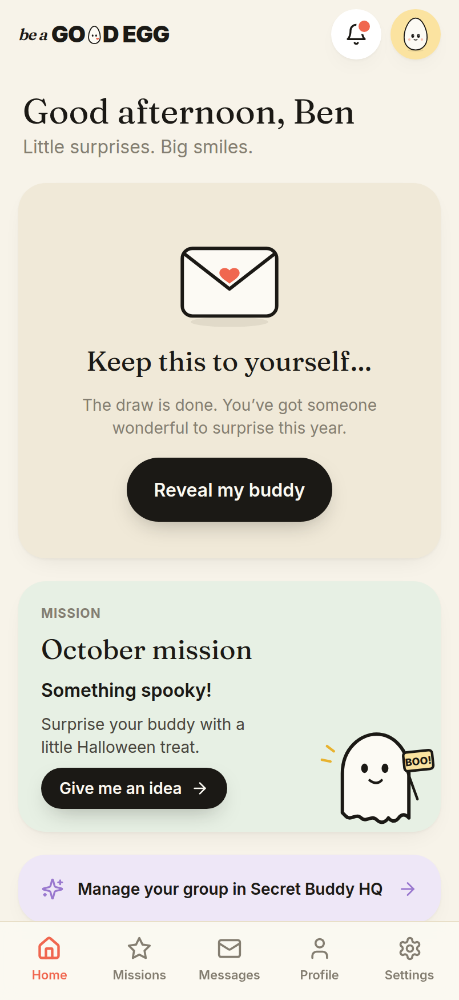
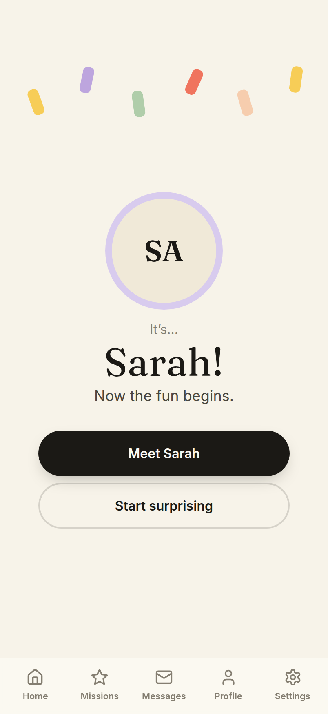
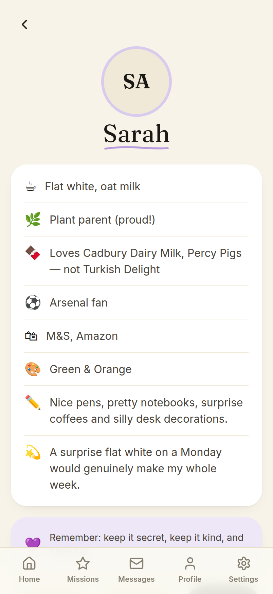
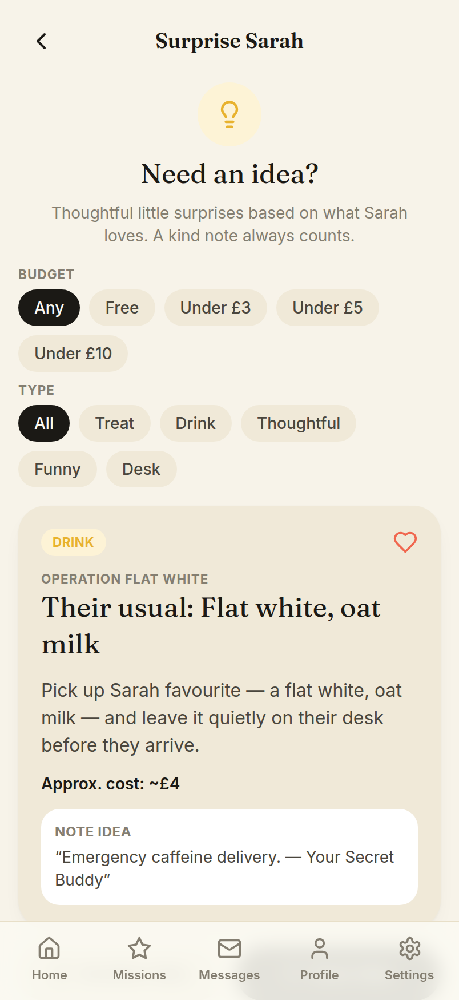
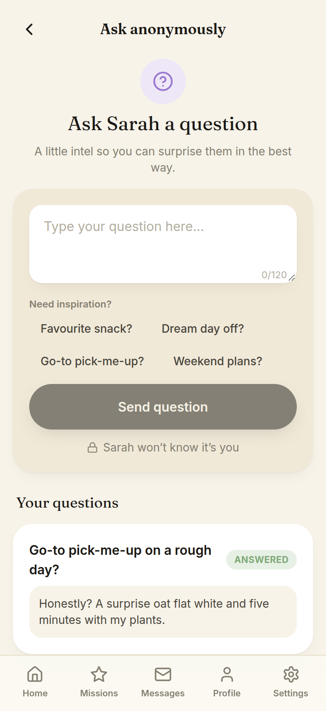
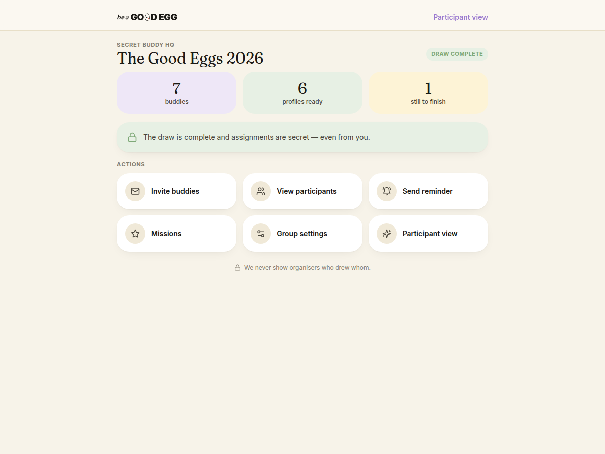

# Be a Good Egg 🥚

**Run year-long Secret Buddy schemes at work.**
_Little surprises. Big smiles._

Be a Good Egg is a mobile-first web app for organising a workplace **Secret Buddy**
scheme that runs for a whole year — not a one-off Christmas draw. Each person is
secretly paired with a colleague, and over the months they leave small, thoughtful
surprises: a favourite coffee on a hard morning, a handwritten note, a daft desk
ornament. The app quietly does the matchmaking, remembers everyone's likes, and
suggests kind little things to do — without ever turning generosity into a
competition.

> The point is kindness, not gifts. A well-timed thank-you counts every bit as
> much as anything bought.

---

## Why it exists — the emotional proposition

Workplaces are warmer when people feel noticed. Most "Secret Santa" tools optimise
for a single gift exchange and a spreadsheet. Be a Good Egg optimises for **a year
of small kindnesses** and for the quiet delight of being thought of. It removes the
awkward admin (who has who, what do they like, what could I possibly do) and leaves
only the nice part.

See [`docs/PRODUCT_PRINCIPLES.md`](docs/PRODUCT_PRINCIPLES.md) for the six
principles that govern every decision — chief among them: **no gamification of
generosity**.

---

## Screenshots

Captured from the running demo (`npm run gen:screenshots`).

| Home | Reveal | Buddy profile |
| --- | --- | --- |
|  |  |  |

| Get an idea | Ask anonymously | Organiser HQ |
| --- | --- | --- |
|  |  |  |

---

## Features (mapped to the MVP flows)

| Flow | What the participant / organiser does | Backed by |
| --- | --- | --- |
| **Create a group** | Organiser starts a scheme, gets a shareable join code + link/QR | `Group`, `makeJoinCode`, `joinUrl` |
| **Join a group** | Participant joins with a code, no faff | `GroupMember`, join code |
| **Build a buddy profile** | Share likes: drink, snacks, shops, interests, colours, "little things", dislikes & dietary needs | `BuddyProfile` |
| **Run the draw** | Organiser triggers a fair, secret pairing (respecting exclusions) | `computeDraw`, `run-draw` edge function |
| **See your buddy** | Participant sees _only_ the person they give to | `Assignment` (per-giver access) |
| **Get a surprise idea** | Tailored, low-cost "Operation …" ideas from the buddy's profile | `templateIdeaProvider` (`ideas.ts`) |
| **Ask anonymously** | Ask the buddy a question without revealing who's asking | `AnonymousQuestion` |
| **Missions** | Gentle, optional prompts to spark kindness | `Mission` |
| **Accomplices** _(schema now, full flow later)_ | Recruit a colleague to help pull off a surprise | `Accomplice` |
| **Inbox** | Answered questions, new ideas, missions, accomplice nudges | `InboxItem` (derived) |

The draw quality goals (no self-matches, everyone gives and receives once, avoid
reciprocal A↔B pairs, honour exclusions, deterministic re-runs) live in
[`src/lib/draw.ts`](src/lib/draw.ts) and are explained in
[`docs/ARCHITECTURE.md`](docs/ARCHITECTURE.md).

---

## Tech stack

| Layer | Choice |
| --- | --- |
| Language | TypeScript (strict) |
| UI | React 18 |
| Build / dev | Vite 5 |
| Styling | Tailwind CSS 3 (custom "cream & pastel" tokens) |
| Routing | React Router 6 |
| Server state | TanStack Query 5 |
| Client state | Zustand 4 |
| Animation | Framer Motion 11 |
| Icons | lucide-react |
| Fonts | Fraunces (display) + Inter (body), self-hosted via Fontsource |
| PWA | `vite-plugin-pwa` |
| Tests | Vitest + Testing Library |
| Backend _(optional)_ | **Pick one** — see below |

The frontend talks to a **`DataProvider`** abstraction, so it never needs to know
which backend is behind it. Three implementations ship, selected by the
`VITE_DATA_PROVIDER` build-time variable:

| `VITE_DATA_PROVIDER` | Backend | Use it for |
| --- | --- | --- |
| `local` _(default)_ | In-browser seeded demo | Instant review, no server |
| `api` | Self-hosted Hono API + Postgres (`/server`) | **Railway** / Fly / a VPS — see [`docs/RAILWAY.md`](docs/RAILWAY.md) |
| `supabase` | Supabase (Postgres + Auth + RLS + edge fn) | Managed backend — see below |

Both real backends use **passwordless 6-digit email codes** and enforce the same
secrecy model (assignments are never sent to a client; the draw is server-side).

---

## Prerequisites

- **Node.js 20+** and npm.
- That's it for local development — **no Supabase required** to run the demo.

---

## Quick start

```bash
npm install
npm run dev
```

`npm run dev` runs against the **local seeded demo provider** (`VITE_DATA_PROVIDER=local`,
the default in `.env.example`). This is an in-browser backend with realistic seed
data — no accounts, no network, nothing to provision. It's perfect for design
review and for exploring every flow.

**Demo login:** sign in as **"Ben"** to land straight in a populated group.

---

## Scripts

| Script | What it does |
| --- | --- |
| `npm run dev` | Start Vite dev server (local demo provider) |
| `npm run build` | Type-check the project references then build to `dist/` |
| `npm run preview` | Preview the production build locally |
| `npm run test` | Run the Vitest suite once |
| `npm run test:watch` | Run Vitest in watch mode |
| `npm run typecheck` | Type-check the app **and** the server |
| `npm run lint` | ESLint over `.ts`/`.tsx` |
| `npm run start` | Run the production server (`/server`, serves `dist/` + API) |
| `npm run server:dev` | Run the API with live reload |

---

## Self-hosting on Railway (no Supabase)

Prefer to own your stack? The `/server` folder is a small **Hono API + Postgres**
backend that serves the SPA and the API from one service, with passwordless
6-digit email-code auth. Full guide: **[`docs/RAILWAY.md`](docs/RAILWAY.md)**.

Try it locally with **no database to install** (in-process Postgres via PGlite):

```bash
# terminal 1 — API on :8080 with demo data
USE_PGLITE=true SEED_DEMO=true npm run server:dev
# terminal 2 — frontend on :5173, /api proxied to the server
VITE_DATA_PROVIDER=api npm run dev
```

Sign in as `ben@work.example` (the code prints in terminal 1).

---

## Pointing at a real Supabase

The local demo is enough for most work. To run against a real backend:

1. Copy the env template and choose the Supabase provider:

   ```bash
   cp .env.example .env.local
   ```

   ```dotenv
   VITE_DATA_PROVIDER=supabase
   VITE_SUPABASE_URL=https://<your-project>.supabase.co
   VITE_SUPABASE_ANON_KEY=<your-anon-key>
   ```

2. Apply the database schema and policies:

   ```bash
   supabase db push
   ```

3. Deploy the privileged draw function and set its secret:

   ```bash
   supabase functions deploy run-draw
   supabase secrets set SUPABASE_SERVICE_ROLE_KEY=<service-role-key>
   ```

The service-role key is **server-side only** — it never reaches the browser. See
[`docs/DEPLOYMENT.md`](docs/DEPLOYMENT.md) and [`docs/SECURITY.md`](docs/SECURITY.md).

---

## Project structure

```
be-a-good-egg/
├─ index.html               # App shell, PWA meta, theme colour
├─ src/
│  ├─ main.tsx              # Entry (mounts React, providers)
│  ├─ index.css            # Tailwind layers + base styles
│  ├─ assets/              # Static assets imported by code
│  ├─ components/
│  │  ├─ brand/            # Logo, egg mark, wordmark
│  │  ├─ layout/           # App frame, nav, screens scaffolding
│  │  └─ ui/               # Buttons, cards, sheets — the design system
│  ├─ data/                # DataProvider interface + local / api / supabase impls
│  ├─ features/            # Feature modules (group, buddy, ideas, inbox …)
│  ├─ routes/              # Route components / router config
│  ├─ store/               # Zustand stores (session, UI)
│  ├─ lib/
│  │  ├─ types.ts          # Domain model (single source of truth)
│  │  ├─ draw.ts           # Secret Buddy draw engine (pure)
│  │  ├─ draw.test.ts      # Draw engine tests
│  │  ├─ ideas.ts          # Surprise idea engine + IdeaProvider
│  │  ├─ utils.ts          # ids, join codes, dates, formatting
│  │  └─ cn.ts             # Tailwind class merge helper
│  └─ test/                # Vitest setup
├─ server/                 # Self-hosted Hono API (the "api" backend)
│  ├─ index.ts             # Entry — serves dist/ + /api, runs migrations
│  ├─ app.ts               # Route wiring + auth cookie
│  ├─ repo.ts              # All data access + server-side authz (replaces RLS)
│  ├─ auth.ts              # 6-digit codes + JWT sessions
│  ├─ db.ts                # pg (prod) / PGlite (dev & tests) adapter
│  ├─ schema.sql           # Railway Postgres schema
│  └─ *.test.ts            # PGlite-backed integration tests
├─ supabase/               # Alternative managed backend
│  ├─ migrations/          # SQL schema + RLS policies
│  └─ functions/           # run-draw edge function (service role)
├─ public/                 # Favicon, PWA icons
├─ Dockerfile, railway.json# Self-hosting config
├─ tailwind.config.ts      # Design tokens
└─ vite.config.ts          # Vite + PWA + Vitest config
```

See [`docs/ARCHITECTURE.md`](docs/ARCHITECTURE.md) for how these fit together.

---

## Deploying

Be a Good Egg builds to a static bundle in `dist/`. Deploy it anywhere that serves
static files with SPA fallback:

- **Cloudflare Pages** — build command `npm run build`, output directory `dist`.
- **Vercel** — build command `npm run build`, output directory `dist`.

Set `VITE_DATA_PROVIDER`, `VITE_SUPABASE_URL` and `VITE_SUPABASE_ANON_KEY` as build
environment variables. Full walkthrough in [`docs/DEPLOYMENT.md`](docs/DEPLOYMENT.md).

---

## Never commit secrets

`.env`, `.env.local` and every `.env.*` (except `.env.example`) are git-ignored.
The **only** browser-safe values are `VITE_SUPABASE_URL` and `VITE_SUPABASE_ANON_KEY`.
The **service-role key stays server-side** (a Supabase function secret) and must
never be added to a `VITE_*` variable, committed, or shipped to the client.

---

## Documentation

| Doc | About |
| --- | --- |
| [`docs/PRODUCT_PRINCIPLES.md`](docs/PRODUCT_PRINCIPLES.md) | The six principles, and how we check them |
| [`docs/ARCHITECTURE.md`](docs/ARCHITECTURE.md) | Frontend architecture, DataProvider, draw engine |
| [`docs/DATABASE.md`](docs/DATABASE.md) | Table-by-table data model & lifecycle |
| [`docs/SECURITY.md`](docs/SECURITY.md) | Threat model & the secrecy guarantees |
| [`docs/DEPLOYMENT.md`](docs/DEPLOYMENT.md) | Shipping the frontend & Supabase |
| [`docs/ROADMAP.md`](docs/ROADMAP.md) | MVP scope, out-of-scope, phased plan |

---

## Licence

© The Be a Good Egg authors. All rights reserved. Licence to be confirmed.
