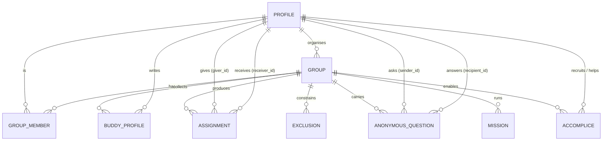

# Data Model

This is the table-by-table reference for Be a Good Egg. It is grounded in
[`src/lib/types.ts`](../src/lib/types.ts) — the **single source of truth** for the
domain. The Supabase schema in `supabase/migrations/` mirrors these shapes; where
the two ever disagree, `types.ts` and this document win until the migration catches
up.

Conventions:

- **`id`** columns are UUIDs (generated with `uid()` in the local provider,
  `gen_random_uuid()` in Postgres).
- Timestamps (`*_at`, `*_date`) are ISO-8601 strings in the type layer and
  `timestamptz` / `date` in Postgres.
- Arrays (`text[]`) hold lightly-normalised lists — a deliberate choice for a
  low-friction, human product (principle 2.5).

---

## Entity overview (ER)



```
 Profile ─┬─< GroupMember >─┬─ Group
          │                 ├─< BuddyProfile
          │                 ├─< Assignment      (giver_id, receiver_id → Profile)   [SECRET]
          │                 ├─< Exclusion       (giver_id, receiver_id → Profile)
          │                 ├─< AnonymousQuestion(sender_id, recipient_id → Profile)[SENDER SECRET]
          │                 ├─< Mission
          │                 └─< Accomplice      (giver_id, helper_id → Profile)
```

---

## Enumerations

| Type | Values | Used by |
| --- | --- | --- |
| `GroupStatus` | `draft`, `open`, `ready`, `drawn`, `revealed`, `archived` | `Group.status` |
| `MemberRole` | `organiser`, `participant` | `GroupMember.role`, `ParticipantSummary.role` |
| `SweetOrSavoury` | `sweet`, `savoury`, `both` | `BuddyProfile.sweet_or_savoury` |
| `QuestionStatus` | `pending`, `answered`, `declined` | `AnonymousQuestion.status` |
| `AccompliceStatus` | `invited`, `active`, `declined` | `Accomplice.status` |

---

## `profiles`

A person. One profile per human account.

| Column | Type | Constraints / notes |
| --- | --- | --- |
| `id` | uuid | PK |
| `display_name` | text | not null |
| `email` | text \| null | nullable |
| `avatar_seed` | text \| null | seeds the deterministic pastel avatar (`avatarBg`) |
| `created_at` | timestamptz | not null |

---

## `groups`

A single year-long Secret Buddy scheme.

| Column | Type | Constraints / notes |
| --- | --- | --- |
| `id` | uuid | PK |
| `name` | text | not null |
| `description` | text \| null | nullable |
| `organiser_id` | uuid | FK → `profiles.id`; the scheme's admin |
| `status` | `GroupStatus` | not null; drives the lifecycle (see below) |
| `join_code` | text | unique; human-friendly, no confusable characters (`makeJoinCode`) |
| `suggested_budget` | integer \| null | optional whole-£ **suggestion**, never a requirement |
| `created_at` | timestamptz | not null |
| `draw_at` | timestamptz \| null | when the draw ran (set at `drawn`) |
| `reveal_date` | timestamptz \| null | optional planned reveal moment |

> `suggested_budget` is nullable and framed only as a gentle steer — kindness, not
> spending (principle 2.1).

---

## `group_members`

Membership of a person in a group, with their role.

| Column | Type | Constraints / notes |
| --- | --- | --- |
| `id` | uuid | PK |
| `group_id` | uuid | FK → `groups.id` |
| `profile_id` | uuid | FK → `profiles.id` |
| `role` | `MemberRole` | `organiser` or `participant` |
| `joined_at` | timestamptz | not null |
| `profile_complete` | boolean | cached flag; the full buddy profile lives in `buddy_profiles` |

Natural uniqueness: one membership per `(group_id, profile_id)`.

---

## `buddy_profiles`

The preferences a participant shares specifically for Secret Buddy. Deliberately
lightly normalised — arrays and free text over many small tables — to keep the
experience friendly and fast to fill in.

| Column | Type | Constraints / notes |
| --- | --- | --- |
| `id` | uuid | PK |
| `group_id` | uuid | FK → `groups.id` |
| `profile_id` | uuid | FK → `profiles.id` |
| `preferred_name` | text | what they like to be called |
| `birthday` | date \| null | optional |
| `drink` | text | e.g. "flat white" — powers "Operation Flat White" |
| `sweet_or_savoury` | `SweetOrSavoury` \| null | tunes treat ideas |
| `favourite_snacks` | text[] | |
| `favourite_shops` | text[] | |
| `interests` | text[] | |
| `favourite_colours` | text[] | |
| `little_things` | text | free text — the small stuff that delights them |
| `dislikes` | text[] | **avoided** by the idea engine's `safeForBuddy` |
| `dietary_requirements` | text[] | **avoided** by the idea engine's `safeForBuddy` |
| `free_text` | text | anything else |
| `updated_at` | timestamptz | not null |

Uniqueness: one buddy profile per `(group_id, profile_id)`. This is the input to the
idea engine (`ideas.ts`).

---

## `assignments` 🔒

**The most sensitive table in the system.** Who gives to whom. Written only by the
privileged `run-draw` Edge Function, and never selectable by ordinary clients — a
participant learns only their _own_ receiver through a narrow, per-giver path.

| Column | Type | Constraints / notes |
| --- | --- | --- |
| `id` | uuid | PK |
| `group_id` | uuid | FK → `groups.id` |
| `giver_id` | uuid | FK → `profiles.id`; gives exactly once per group |
| `receiver_id` | uuid | FK → `profiles.id`; receives exactly once per group |
| `created_at` | timestamptz | not null |

Invariants (enforced by `computeDraw` / `validateDraw` and by uniqueness):

- `giver_id ≠ receiver_id` (no self-assignment)
- unique `giver_id` per group (out-degree 1)
- unique `receiver_id` per group (in-degree 1)
- no `(giver_id, receiver_id)` that appears in `exclusions`

See [`SECURITY.md`](SECURITY.md) for the access model — this table is deny-by-default.

---

## `exclusions`

Forbidden pairings the draw must avoid — e.g. partners, someone who had this buddy
last year, or a manager/report pair.

| Column | Type | Constraints / notes |
| --- | --- | --- |
| `id` | uuid | PK |
| `group_id` | uuid | FK → `groups.id` |
| `giver_id` | uuid | FK → `profiles.id`; must never be assigned `receiver_id` |
| `receiver_id` | uuid | FK → `profiles.id` |
| `reason` | text \| null | optional organiser note |
| `created_at` | timestamptz | not null |

Fed straight into `computeDraw` as `DrawExclusionPair`s.

---

## `anonymous_questions` 🔒

A giver can ask their buddy a question without revealing who is asking. The
recipient can answer or decline; the **`sender_id` is never revealed** to the
recipient.

| Column | Type | Constraints / notes |
| --- | --- | --- |
| `id` | uuid | PK |
| `group_id` | uuid | FK → `groups.id` |
| `sender_id` | uuid | FK → `profiles.id`; the asker (the giver) — **kept secret from the recipient** |
| `recipient_id` | uuid | FK → `profiles.id`; the recipient (the giver's buddy) |
| `question` | text | not null |
| `answer` | text \| null | null until answered |
| `status` | `QuestionStatus` | `pending` → `answered` / `declined` |
| `created_at` | timestamptz | not null |
| `answered_at` | timestamptz \| null | set when answered/declined |

The recipient-facing view must project `question`, `answer`, `status` — **never**
`sender_id`.

---

## `missions`

Gentle, optional prompts an organiser can run to spark kindness. Never obligations,
never scored.

| Column | Type | Constraints / notes |
| --- | --- | --- |
| `id` | uuid | PK |
| `group_id` | uuid | FK → `groups.id` |
| `title` | text | not null |
| `tagline` | text | short hook |
| `body` | text | the prompt |
| `accent` | enum | card theme: `sage` \| `lilac` \| `peach` \| `yolk` \| `coral` |
| `starts_at` | timestamptz \| null | optional window start |
| `ends_at` | timestamptz \| null | optional window end |
| `created_at` | timestamptz | not null |

---

## `accomplices`

An accomplice helps a giver pull off a surprise for their buddy. **Schema now, full
flow later** (see [`ROADMAP.md`](ROADMAP.md)).

| Column | Type | Constraints / notes |
| --- | --- | --- |
| `id` | uuid | PK |
| `group_id` | uuid | FK → `groups.id` |
| `giver_id` | uuid | FK → `profiles.id`; the giver who recruited help |
| `helper_id` | uuid | FK → `profiles.id`; the colleague recruited |
| `status` | `AccompliceStatus` | `invited` → `active` / `declined` |
| `created_at` | timestamptz | not null |

Because a helper learns who a giver's buddy is, accomplice records are sensitive and
scoped to the giver and helper only.

---

## Derived / view models (not stored)

These are assembled in the app from the tables above; they have **no table of their
own**. Their existence — and their careful omissions — encode product principles.

| Type | Shape | Why it exists |
| --- | --- | --- |
| `InboxItem` | `id`, `kind` (`question_answered` \| `question_received` \| `new_idea` \| `new_mission` \| `accomplice`), `title`, `body`, `created_at`, `read`, `href?` | Unified activity feed |
| `Membership` | `{ group: Group; member: GroupMember }` | A membership joined with its group |
| `ParticipantSummary` | `member_id`, `profile_id`, `display_name`, `avatar_seed`, `role`, `profile_complete`, `joined_at` | **Organiser-safe** view of a participant — **never includes assignment data** |

> `ParticipantSummary` is the only participant view an organiser gets. It exposes
> logistics (is the profile complete?) and **nothing** about giving — no
> assignment, no counts, no spend. This is principle 2.2 expressed in the type
> system.

---

## Group lifecycle state machine

`Group.status` moves forward through six states. Transitions are driven by organiser
actions and by the draw.

```
 draft ──open──► open ──everyone ready──► ready ──run draw──► drawn ──reveal──► revealed ──wrap up──► archived
   │                                                            ▲
   └──────────────── organiser edits ──────────────────────────┘
```

| Status | Meaning | Who can do what | Enters when |
| --- | --- | --- | --- |
| `draft` | Being set up; not yet joinable | Organiser configures name, budget, exclusions | Group created |
| `open` | Joinable; people join and build buddy profiles | Participants join via `join_code`; fill `buddy_profiles` | Organiser opens the group |
| `ready` | Enough complete profiles to draw | Organiser reviews completeness (`profile_complete`) | Organiser marks ready / criteria met |
| `drawn` | The draw has run; `assignments` exist | Participants see **only their own buddy**; ideas/questions unlock | `run-draw` succeeds (sets `draw_at`) |
| `revealed` | Optional reveal moment has happened | Identities may be shared per the reveal design | On/after `reveal_date` |
| `archived` | The year is over | Read-only wrap-up | Organiser archives |

Notes:

- The draw can only run from `ready`; it moves the group to `drawn` and stamps
  `draw_at`. It writes `assignments` transactionally — all pairs or none.
- `reveal_date` is optional; a group may skip a formal reveal.
- Backward moves (e.g. re-opening from `ready` to `open`) are organiser edits before
  the draw; **once `drawn`, assignments are fixed** to preserve fairness and secrecy.
